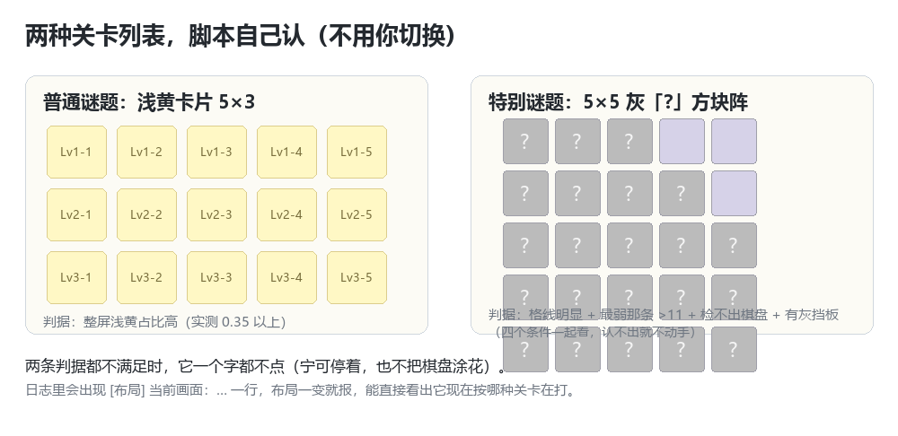

# Miku 数织自动闯关（Hatsune Miku Logic Paint S 辅助工具）

Windows 上给《Hatsune Miku Logic Paint S》里那套数织（nonogram / 数方）小游戏做的**自动闯关工具**。
它看着游戏窗口截图，自己认提示数字、求解、点格子、过关、再点下一关；带一个本地面板可以点按钮，
也可以纯命令行跑。

> 非官方项目，与游戏发行商/开发商无关。仅供个人学习与自用，请自行遵守游戏的服务条款。

## ⬇️ 下载（Windows，免安装）

**[点这里直接下载 MikuNonogramBot-1.0.9-win64.zip](https://github.com/angaotian/MikuNonogramBot/releases/latest/download/MikuNonogramBot-1.0.9-win64.zip)**（约 32 MB，自带面板，不用装 Python）

- 想下最新版永远用这个地址：<https://github.com/angaotian/MikuNonogramBot/releases/latest>
- 只想看代码：[MikuNonogramBot-1.0.9-src.zip](https://github.com/angaotian/MikuNonogramBot/releases/latest/download/MikuNonogramBot-1.0.9-src.zip)
- 下载后：**解压 → 双击 `启动面板.bat` → 把游戏停在关卡列表或棋盘上 → 点「连续闯关」**

> 在 GitHub 网页上找不到下载位置的话：页面**右侧边栏**的 **Releases → v1.0.9**，或页面底部 **Releases** 区域，点进去最下面就是 **Assets**（两个 zip）。

## 长什么样

**控制面板**（不想开面板也可以纯命令行跑）：


**它自己怎么跑完一关**（全自动，不用你动手）：


**两种关卡列表它都认得**（普通谜题 / 特别谜题，不用你切换）：



> 上面都是示意图，用脚本画的（`tools/make_readme_images.py`），不是游戏截图——游戏画面与美术版权归厂商所有。

## 它能做什么

- **自动读题**：截图 → OCR 识别行/列提示数字 → 交叉校验（行和=列和、可解、三帧一致）才开打
- **自动解题**：完整的数织求解器（含唯一解判定的多种尺寸 5×5 ~ 25×25）
- **自动填格**：分批填色 + 用「游戏自己的提示变灰」当判官，每批自查；空格按需打叉
- **自动连打**：过关后自动回列表、点下一关；读不通的关卡记进跳过表，先去打别的
- **两种关卡列表都会认**：普通谜题（浅黄卡片）与**特别谜题**（5×5 灰「?」方块阵）自动识别切换
- **紧急停止**：F8 / Esc / 把鼠标甩到屏幕左上角

## 下载即用（推荐，不需要装 Python）

1. 下载 **`MikuNonogramBot-1.0.9-win64.zip`**（上面那个直链，或页面上 Releases 里的 Assets）
2. 解压到任意目录
3. 双击 **`启动面板.bat`** → 面板窗口打开 → 把游戏停在关卡列表或棋盘上 → 点「连续闯关」

运行包自带 `MikuPanel.exe`（面板 GUI）与主脚本，面板启动时会自检、必要时自动把三份真源同步进 exe。
**仍然需要**：Windows + WebView2 运行时（Win11 自带）+ 本机装好 **Tesseract-OCR**（读数字用，见下）。

## 从源码跑（想改代码/命令行用这个）

```bat
pip install -r requirements.txt
python miku_logic_paint_bot.py --selftest     :: 不需要游戏的自检，先确认环境 OK
python miku_logic_paint_bot.py --loop         :: 开始连续闯关（游戏窗口保持在前台）
python miku_logic_paint_bot.py --dry-run      :: 只识别+求解，不点游戏
```

环境要求：

| 依赖 | 说明 |
|---|---|
| Python 3.10+ | 主脚本 |
| Pillow / numpy / pytesseract | `pip install -r requirements.txt` |
| **Tesseract-OCR** | 装在 `C:\\Program Files\\Tesseract-OCR\\` 或加入 PATH（脚本会自动找） |
| WebView2 运行时 | 只有面板 GUI 需要；命令行不需要 |

## 如何使用（一步一步）

### A. 用面板（推荐）

1. 解压 → 双击 **`启动面板.bat`**（面板会自检，必要时自动把源码同步进 exe）
2. 打开游戏，把窗口**切到前台**（别最小化、别被别的窗口盖住）
3. 停在**关卡列表**或**某一关的棋盘**上都行，脚本两种都认
4. 面板上点「**连续闯关**」（只跑一关就点「跑一关」）→ 日志开始刷
5. 想停：点「停止」，或按 **F8 / Esc**，或把鼠标**甩到屏幕左上角**
6. 第一次跑发现定位不准：关掉游戏侧的缩放/多余窗口，或跑一次 `python miku_logic_paint_bot.py --calibrate`

### B. 用命令行

```bat
python miku_logic_paint_bot.py --selftest    :: 先自检（不用开游戏）
python miku_logic_paint_bot.py --loop        :: 连续闯关
python miku_logic_paint_bot.py --dry-run     :: 只识别+求解，不点游戏（想先看它读得准不准）
```

### C. 它什么时候会「不动手」（安全设计）

| 情况 | 它的反应 |
|---|---|
| 认不出画面（既不是棋盘也不是列表） | **一个字都不点**，只等着；不会乱点把画面点乱 |
| 读题对不上（行和≠列和 / 无解 / 三帧不一致） | 先重置本关再读一次；第二次还读不通 → **跳过这关去打别的**（跳过前会确认这一关盘面是干净的） |
| 填色过程中自查没过 | 立刻停手并报出是哪一行/列对不上，不会硬着头皮涂完 |
| 关卡列表布局不认识 | 当作「不是列表」，不点击（两种布局的坐标完全不同，点错会点到棋盘上） |

## 规则

### 游戏规则（它替你自动做的那些事）

| 操作 | 说明 |
|---|---|
| 左键点格子 | 给**空格**涂色（青色）。对「已经有内容」的格子无效——所以一旦某格被误标就涂不上了 |
| 右键点格子 | 给**空格**打叉（灰紫叉），表示这格该空着 |
| 提示数字 | 每行（左侧）与每列（上方）给一串数字，表示这一行/列里**连续涂色块**的长度与顺序，例如 `3 1 2` |
| 怎么算对 | 某一行/列**所有该涂的格子都涂满**时，游戏会把这行/列的提示数字**变灰**——脚本就拿这个当判官 |
| 过关 | 整幅棋盘涂对 → 弹出「关卡完成」→ 回到关卡列表 |
| 特别谜题 | 8 个 Lv 页，每页 25 格拼图，每一格是一道小谜题；解开一格就露出那部分画作 |
| 任务 | 每格 3 个任务：解开谜题 / 无提示 / 无失误 |

### 使用规则（请照着来，否则会失败或伤到你自己的存档）

1. **游戏窗口保持在前台**，别最小化、别被挡住——它是「看屏幕 + 点鼠标」，看不见就读错。
2. **跑的时候别抢鼠标键盘**（除了 F8/Esc 停止）：它会自己移鼠标点格子，你一动鼠标就会点歪。
3. **同一台机器、同一套显示设置**：换了分辨率 / 屏幕缩放 / DPI 之后，重新校准一次（`--calibrate`）。
4. **别在它跑的时候手动涂格**：它按自己解出来的答案涂，你手改一格它下一批自查就会失败停下（不会涂花，但这一关得重来）。
5. **它只做三件事**：截屏识别、移鼠标点击、写本机日志。**不读游戏内存、不改游戏文件、不联网上传**。
6. **自动化可能违反游戏的服务条款**：这是给单人离线小游戏写的自用工具，用不用、风险多大请自己判断（见下面免责声明）。
7. **它会往 `debug/` 存现场截图**（读不通时的画面，只在本机），里面可能有你的桌面内容——**分享这些截图前先看一眼**。

## 命令行参数

```
--loop [N]              连续闯关（N 为关数，省略表示一直打）
--dry-run               只识别+求解，不点击
--calibrate [--manual]  重新校准棋盘位置与尺寸（默认自动定位）
--probe                 诊断当前画面并保存标注截图
--goto R,C              把鼠标移到指定格子中心（0,0 = 左上角）后退出
--selftest              不需要游戏的自检（求解器 + 定位 + 列表布局 + 端到端）
--confirm               每次填格前按 Enter 确认
--mark-empty / --no-mark-empty   空隙要不要右键打叉（默认打）
--list-mode {auto,normal,special}   关卡列表布局：默认 auto 自动识别
--window WINDOW         自定义窗口标题关键字（逗号可多个）
--config CONFIG         指定配置文件路径
--hide-console          启动后最小化控制台
```

## 配置（`miku_bot_config.json`）

| 键 | 默认 | 作用 |
|---|---|---|
| `window_keywords` | Logic Paint / Hatsune / Miku | 认游戏窗口用的标题关键字 |
| `click_interval_ms` | 10 | 两下点击之间等多久（游戏卡就调大到 80~120） |
| `click_hold_ms` | 16 | 单次点击按下到抬起的毫秒数 |
| `fills_per_pause` | 24 | 每涂多少格做一次「提示变灰」自查 |
| `max_read_attempts` | 3 | 同一关最多读几次题 |
| `ocr_workers` | 8 | OCR 线程数（读数偶发不稳就设 1） |
| `list_mode` | auto | 关卡列表布局：auto / normal / special |
| `geom` | 自动写入 | 棋盘位置与格宽（`--calibrate` 或首次运行时自动落盘） |

## 怎么确认它认对了

- 跑起来日志里会出现 `[布局] 当前画面：特别谜题（5×5 灰「?」方块阵）` / `普通谜题（浅黄卡片）`——
  **布局一变就报一行**，这是「它知道自己在打哪种关卡」的直接证据。
- 面板日志里 `已回到关卡列表（特别谜题方块阵），点开这一格…` 与 `已回到关卡列表，点开这一关…`
  分别对应两种模式。
- 命令行 `python debug\probe_special_list.py --live`（那是开发用的探针，**不随发布包提供**，只在本项目的开发目录里）
  可以只读地看一眼：布局判定、25 格逐格判定、下一步会点哪一格（不点击）。

## 遇到问题先看《宇宙声明》

下载包里有个 **`宇宙声明.txt`**，就三件事，跑不顺的时候先看它：

1. **极个别关卡识别不出来** —— 目前已知读不通的是 **Lv3-016**、**Lv3-064** 这两关（提示数字字太小）；
   脚本自己跳过、先去打别的关，想让它回头再试就重启脚本。真碰上就用**你的超级大脑亲自征服它**——一两关，手点比等快 :)
2. **遇到「涂了一半 → 一直重置 → 退出」的循环** —— 直接停掉脚本再启动一次（面板「停止」→「连续闯关」）；
   它跳过一关之前会先确认那一关盘面干净，不会留下没打完的棋。
3. **游戏窗口与分辨率要求** —— 窗口要在前台；推荐 1920×1080 / 1280×720，其它分辨率先 `--calibrate`；
   屏幕缩放保持 100%；别用独占全屏；副屏/投屏/远程桌面会改变截图尺寸。

## 已知限制（写清楚，别踩）

- **OCR 偶发读错**：个别关卡的小字号提示数字会被读错（表现为某一行/列始终不变灰）；
  脚本会三帧校验 + 纠错，还读不通就跳过这关去打别的，不会乱涂。
- **屏幕/窗口**：默认按客户区尺寸自适应（1280×720 / 1920×1080 实测），其它分辨率靠 `--calibrate` 自动定位；
  游戏窗口要能保持在前台，被遮挡会读错。
- **面板外壳不在源码里**：`MikuPanel.exe` 是一个 PyInstaller 打包的二进制（pywebview 外壳），
  本仓库只提供成品 exe 与「原地补丁式」打包工具 `tools/panel_build.py`（它需要一个现成 exe 当底座）。
  `panel/index.html` + 主脚本 + 配置是三份真源，改完用 `tools/panel_build.py` 同步进 exe。
- **仅 Windows**：窗口枚举、DPI、点击注入都用的 Win32 API。
- 游戏更新可能改界面，届时需要重新量坐标（`debug/` 里的探针是干这个用的，不随发布包提供）。

## 项目结构

```
miku_logic_paint_bot.py      主脚本（读题 / 求解 / 点击 / 连打，唯一的功能真源）
miku_bot_config.json         运行配置
panel/index.html             面板界面（改它必须重打包进 exe）
panel/shell/README.md        面板外壳（二进制）的行为记录与三条硬约束
tools/panel_build.py         把三份真源同步进 exe（原地补丁 + 全量体检 + 原子替换）
tools/panel_verify.py        体检：exe 内容物 vs 真源 / 副本 / 运行环境
tools/panel_extract.py       从 exe 里解出三份真源（对照用）
tools/panel_archive.py       PyInstaller CArchive 读写（供上面几个工具用）
tools/panel_shell_disasm.py  外壳字节码反汇编导出
启动面板.bat / 启动.bat        图形入口 / 命令行入口
MikuPanel.exe                预编译面板（Release 包提供）
docs/开发记录.md              开发记录：每条判据、每次踩坑与验证方式
```

## 开发与打包

打包/校验工具（`tools/panel_*.py`）要读写 exe 里的 PyInstaller CArchive，**额外需要 PyInstaller**：

```bat
pip install pyinstaller
python tools\\panel_verify.py     :: 先看 exe 与真源是否一致（内容物 / 副本 / 运行环境）
python tools\\panel_build.py      :: 打包（写 .new → 全量体检 → 备份旧版 → 原子替换）
python miku_logic_paint_bot.py --selftest
```

`panel_build.py` 是**原地补丁式**打包：它需要一个现成的 `MikuPanel.exe` 当底座（面板外壳的源码不在本仓库），
只改内容变了的条目，写完先落成 `MikuPanel.exe.new` 并做全量体检
（253 个条目全部可读、未改条目字节级一致），通过才替换；任何一步失败原 exe 一字节不动。

## 免责声明

本项目与《Hatsune Miku Logic Paint S》的发行商、开发商无任何关系，也不包含游戏的任何素材。
它是一个「看屏幕 + 点鼠标」的自动化脚本，作者不保证适用于任何特定用途；
使用前请自行确认不违反你所处地区的法律与游戏的服务条款，风险自负。

## 许可

MIT License（见 `LICENSE`）。游戏名称与相关商标归其各自权利人所有。
